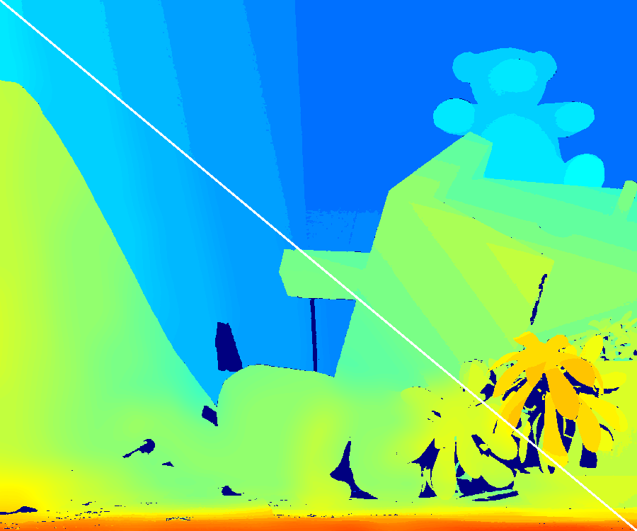

Documents: Bilateral Filter
===========================

**void bilateralFilter(const Mat& src, Mat& dst, Size kernelSize, double sigma_color, double sigma_space, int method, int borderType)**
* Mat& src: input image.  
* Nat& dst: filtered image.  
* Size kernelSize: kernel size.  
* double sigma_color: Gaussian sigma for color weight.  
* double sigma_space: Gaussian sigma for color weight.  
* int method: switch for various implimentations (default is BILATERAL_DEFAULT).   
* int borderType: boundary copying function (default is cv::BORDER_REPLICATE).  

The *method* has following options:　　

    enum{
    FILTER_DEFAULT = 0, //default is circle type.
    FILTER_CIRCLE = 0, //kernel shape is circlar from. If a support pixel (q) in a kernel has a large distance |p-q|^2 > r^2, coefficient is forcibly 0.(p is a center pixe.)
    FILTER_RECTANGLE , //kernel shape is squre or reqtangler type. 
    FILTER_SEPARABLE,// sepalable implimentation of ref. 2.
    FILTER_SLOWEST// non-parallel and un-effective implimentation for just comparison.    
    };
    
    enum{
    BILATERAL_ORDER2=10,//exponential function is approxmated by Taylor expansion(underconstruction)
    BILATERAL_ORDER2_SEPARABLE,// spalable implimentation of  ORDER2(underconstruction)
    };

**void jointBilateralFilter(const Mat& src, const Mat& guide, Mat& dst, Size kernelSize, double sigma_color, double sigma_space, int method, int borderType)**  
* Mat& src: filtering target image.    
* Nat& guide: guidance image for joint bilateral filtering.    
* Other argements are same as the bilateral filter function.  

The function is implementation of papers[3,4]. Paper[3] calls this filter as joint bilateral filter, and paper[4] calls this filter cross bilateral filter.  

**void binalyWeightedRangeFilter(const Mat& src, Mat& dst, Size kernelSize, float threshold, int method=BILATERAL_DEFAULT, int borderType=cv::BORDER_REPLICATE)**  
* Mat& src: filtering target image.  
* Size kernelSize: kernel size.  
* float threshold: if a value <threshold, then the weight of kernel is 1 otherwise, 0.  
* Other argements are same as the bilateral filter function.  

This filter is A weighted mean filter: domain kernel is binary (0 or 1), and spatial kernel is constant (1). 
The filter is a case of the epsilon filter. The filter is used for;    
* a simlified bilateral filter (faster than the bilateral filter),     
* depth-map range interporation,    
* an approximation of orthogonal integral images for cross based local stereo matching.   

**void jointBinalyWeightedRangeFilter(const Mat& src, const Mat& guide, Mat& dst, Size kernelSize, float threshold, int method=BILATERAL_DEFAULT, int borderType=cv::BORDER_REPLICATE)**  
* This filter is jointly filtering version of the binalyWeightedRangeFilter.
    
The filter is a case of the epsilon filter. The filter is used for;   
* a simlified joint bilateral filter (faster than the bilateral filter),   
* depth-map estimation for adaptive kernel,    
* mosquite noise reduction.  

Example of bilateral filter: computational speed
------------------------------------------------
Computational time for a 1M pixel (1024 * 1024) and color image with following methods:  
* OpenCV implimentation  
* BILATERAL_DEFAULT  
* SEPARABLE  
* SLOWEST  

each median value in 10 times trials is plotted.  
**Tested on Dual CPU of Intel Xeon X5690 3.47Ghz (12 core * HT), 64bit OS, Visual Studio 2012's compiler**  

Example of joint bilateral filter: flash-no-flash photography  
-------------------------------------------------------------

  
left upper: non flash,  right down: flash  

  
left upper: result of bilateral filter,  right down: result of joint bilateral filter  

Example of binary weighted range filter: range value interpolation of depth map  
-------------------------------------------------------------------------------
  
A result of interpolation of range value for depth map data.  

Reference
---------
1. Tomasi, Carlo, and Roberto Manduchi. "Bilateral filtering for gray and color images," Proc. IEEE International Conference on Computer Vision (ICCV), 1998.  
2. Pham, Tuan Q., and Lucas J. Van Vliet. "Separable bilateral filtering for fast video preprocessing," IEEE International Conference on Multimedia and Expo (ICME) 2005.
3. G. Petschnigg, R. Szeliski, M. Agrawala, M. Cohen, H. Hoppe, and K. Toyama, "Digital photography with flash and no-flash image pairs," ACM transactions on graphics (TOG), vol. 23, no. 3, pp. 664-672, Aug. 2004.
4. E. Eisemann and F. Durand, "Flash photography enhancement via intrinsic relighting," ACM transactions on graphics (TOG), vol. 23, no. 3, pp. 673-678, Aug. 2004.
5. K. Zhang, J. Lu, G. Lafruit, "Cross-Based Local Stereo Matching Using Orthogonal Integral Images," IEEE Transactions on Circuits and Systems for Video Technology, vol.19, no.7, pp.1073-1079, July 2009. 
