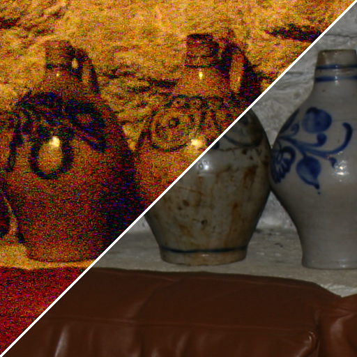

Documents: Birateral Filter
===========================

**void bilateralFilter(const Mat& src, Mat& dst, Size kernelSize, double sigma_color, double sigma_space, int method, int borderType)**
* Mat& src: input image.  
* Nat& dst: filtered image.  
* Size kernelSize: kernel size.  
* double sigma_color: Gaussian sigma for color weight.  
* double sigma_space: Gaussian sigma for color weight.  
* int method: switch for various implimentations (default is BILATERAL_DEFAULT).   
* int borderType: boundary copying function (default is cv::BORDER_REPLICATE).  

The *method* has following options:　　

    enum{
    BILATERAL_DEFAULT = 0, //default is circle type.
    BILATERAL_CIRCLE = 0, //kernel shape is circlar from. If a support pixel (q) in a kernel has a large distance |p-q|^2 > r^2, coefficient is forcibly 0.(p is a center pixe.)
    BILATERAL_RECT , //kernel shape is squre or reqtangler type. 
    BILATERAL_SEPARABLE,// sepalable implimentation of ref. 2.
    BILATERAL_ORDER2,//exponential function is approxmated by Taylor expansion(underconstruction)
    BILATERAL_ORDER2_SEPARABLE,// spalable implimentation of  ORDER2(underconstruction)
    BILATERAL_SLOWEST// non-parallel and un-effective implimentation for just comparison.    
    };
    

**void jointBilateralFilter(const Mat& src, const Mat& guide, Mat& dst, Size kernelSize, double sigma_color, double sigma_space, int method, int borderType)**  
* Mat& src: filtering target image.    
* Nat& guide: guidance image for joint birateral filtering.    
* Other argements are same as the birateral filter function.  

The function is implimentation of papers[3,4]. Paper[3] calls this filter as joint birateral filter, and paper[4] calls this filter cross birateral filter.  

Example of birateral filter
---------------------------
Computational time for a 1M pixel (1024 * 1024) and color image with following methods:  
* OpenCV implimentation  
* BILATERAL_DEFAULT  
* SEPARABLE  
* SLOWEST  

each median value in 10 times trials is plotted.  
**Tested on Dual CPU of Intel Xeon X5690 3.47Ghz (12 core * HT), 64bit OS, Visual Studio 2012's compiler**  

Example of joint birateral filter: flash-no-flash photography  
---------------------------------

  
left upper: non flash,  right down: flash  

  
left upper: result of birateral filter,  right down: result of joint birateral filter  

Reference
---------
1. Tomasi, Carlo, and Roberto Manduchi. "Bilateral filtering for gray and color images," Proc. IEEE International Conference on Computer Vision (ICCV), 1998.  
2. Pham, Tuan Q., and Lucas J. Van Vliet. "Separable bilateral filtering for fast video preprocessing," IEEE International Conference on Multimedia and Expo (ICME) 2005.
3. G. Petschnigg, R. Szeliski, M. Agrawala, M. Cohen, H. Hoppe, and K. Toyama, "Digital photography with flash and no-flash image pairs," ACM transactions on graphics (TOG), vol. 23, no. 3, pp. 664-672, Aug. 2004.
4. E. Eisemann and F. Durand, "Flash photography enhancement via intrinsic relighting," ACM transactions on graphics (TOG), vol. 23, no. 3, pp. 673-678, Aug. 2004.
