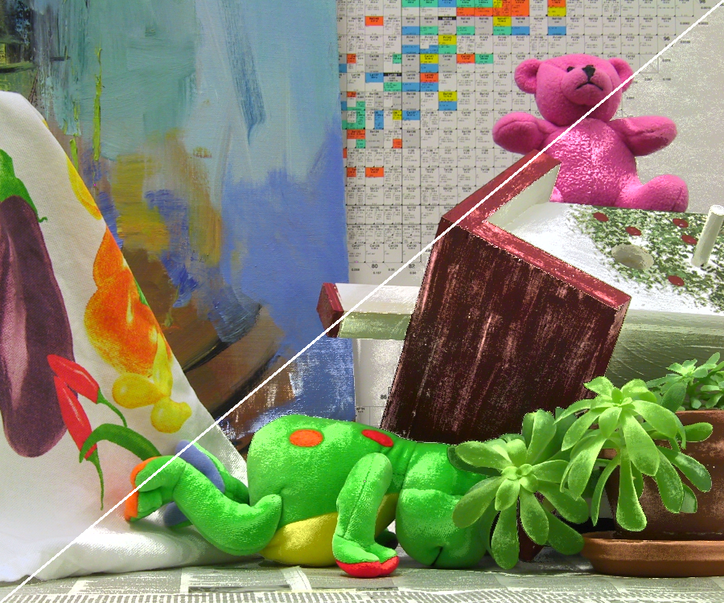

Documents: detail enhancement
=================================

    **void detailEnhancementBilateral(Mat& src, Mat& dest, int d, float sigma_color, float sigma_space, float boost, int color)**
* Mat& src: input image.  
* Mat& dst: filtered image.  
* const Size ksize: size of filtering kernel.  
* const float sigma_color: sigma of color in bilateral filtering.    
* const float sigma_space: sigma of space in bilateral filtering.    
* const float boost: boosting factor.   
* const int color: color channel for using boosting.

        enum
        {
        	PROCESS_LAB=0,
        	PROCESS_BGR
        };

Example of detail enhancement
-----------------------------
  
detail enhancement bilateral filter.

  
iterative back projection  (Birateral filter)  

Reference
---------
1. M. Irani, and S. Peleg. "Improving resolution by image registration," CVGIP: Graphical models and image processing 53(3), pp. 231-239, 1991.  
2. S. Dai, M. Han, Y. Wu, Y. Gong, "Bilateral Back-Projection for Single Image Super Resolution," In Proc. IEEE International Conference on Multimedia and Expo 2012 (ICME), pp. 1039-1042, July 2007.  
