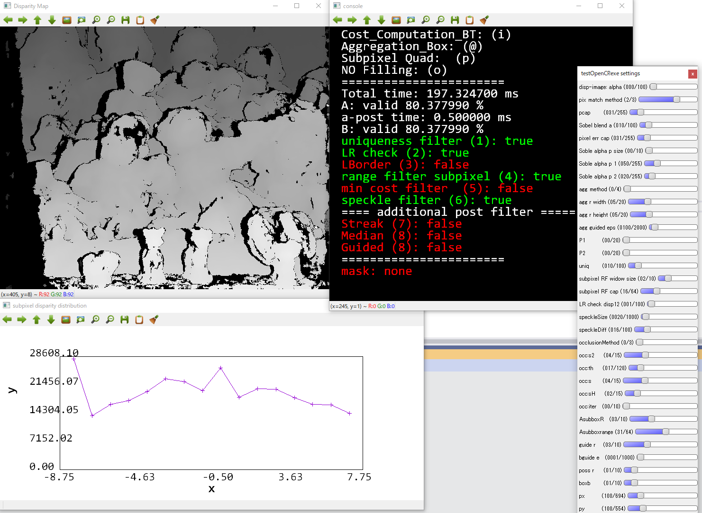

StereoBase.hpp
================

# class StereoBMSimple
処理の本体はこれ．呼び出す主要な関数は下記．
```cpp
void StereoBase::matching(Mat& leftim, Mat& rightim, Mat& destDisparityMap)
{
prefilter(leftim, rightim);
getPixelMatchingCost(d, DSI[i]);	
getCostAggregation(DSI[i], DSI[i], guide);
getWTA(DSI, dest);//最小コストの値を取る
//postprocessings
//...
}
```

```cpp
//0. プレフィルタ
prefilter(leftim, rightim);//X方向のSobelフィルタ min(2*preFilterCap, Sobel(x)+preFilterCap)
//prefilterXSobelの呼び出し

//1. マッチングコスト計算
getPixelMatchingCost(d, DSI[i]);

case Pixel_Matching_SAD:
//getMatchingCostSAD() a*min(|L-R|, pixelMatchErrorCap)+(1-a)*min(|L'-R'|, pixelMatchErrorCap): a = costAlphaImageSobel*0.01, L' Sovel responce
case Pixel_Matching_SAD_TextureBlend:
//textureAlpha(target[0], alpha, prefParam2, prefParam, prefSize);の呼び出し
//getMatchingCostSADAlpha() a*min(|L-R|, pixelMatchErrorCap)+(1-a)*min(|L-R|, pixelMatchErrorCap): a = alpha
case Pixel_Matching_BT:
//getMatchingCostBT() (a*BT(L-R)+(1-a)*BT(L'-R'),pixelMatchErrorCap): a = costAlphaImageSobel*0.01, L' Sobel 
case Pixel_Matching_BT_TextureBlend
//textureAlpha(target[0], alpha, prefParam2, prefParam, prefSize);の呼び出し
//getMatchingCostBTAlpha() (a*BT(L-R)+(1-a)*BT(L'-R'),pixelMatchErrorCap): a = alpha, L' Sobel 


//2. コストアグリゲーション
getCostAggregation(DSI[i], DSI[i], guide);
case Aggregation_Box://ブロックマッチング
case Aggregation_BoxShiftable://シフタブルブロックマッチング
case Aggregation_Gauss://ガウシアン窓のマッチング
case Aggregation_GaussShiftable://ガウシアン窓のシフタブルマッチング
case Aggregation_Guided://ガイデットフィルタによるマッチング．guide画像はこのメソッドしか使わない

//3. 最適化・
getOptScanline();//デバッグした記憶がない
getWTA(DSI, dest);//最小コストの値を取る

//4. ポストフィルタ
uniquenessFilter(minCostMap, dest);//エラーの最最小と2番目のエラーの差を見て曖昧性の高い物をはじく
subpixelInterpolation(dest, subpixMethod);//サブピクセル補間
case SUBPIXEL_NONE:
case SUBPIXEL_QUAD: //双曲線
case SUBPIXEL_LINEAR://線形

binalyWeightedRangeFilter(dest, dest, subboxWindowR, subboxRange);//レンジフィルタによるサブピクセル補間
fastLRCheck(minCostMap, dest);//1枚画像のLRチェック
minCostFilter(minCostMap, dest);//最小コストによるフィルタ：DPなど以外は役に立たないはず．
filterSpeckles(dest, 0, speckleWindowSize, speckleRange, specklebuffer);//スペックルを除去するフィルタ
```


# StereoBMSimple::gui
下記メソッドでGUIによるパラメータ調整が可能．
```cpp
void StereoBMSimple::gui(Mat& leftim, Mat& rightim, Mat& dest, StereoEval& eval)
```

##出力のイメージ．
デプスマップ，パラメータ調整バー，状態，サブピクセル補間のヒストグラム
