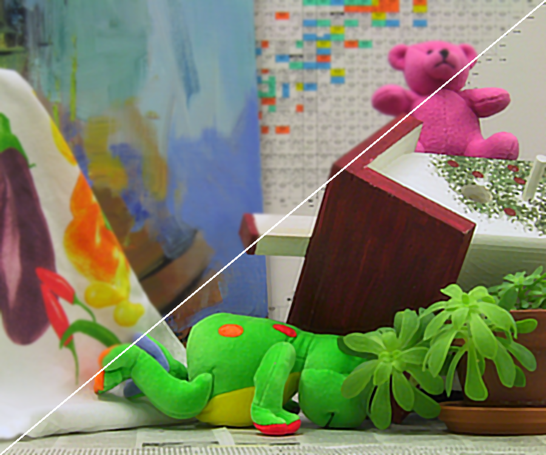

Documents: iterative back projection
====================================

void iterativeBackProjectionDeblurGaussian(const Mat& src, Mat& dest, const Size ksize, const double sigma, const double lambda, const int iteration)
* Mat& src: input image.  
* Nat& dst: filtered image.  
* const Size ksize: size of filtering kernel.  
* const double sigma: sigma of space in Gaussinan filtering for Gussian blur degration and and Gaussian back Projection.    
* const double lambda: update factor.   
* const int iteration: number of iteration.  

void iterativeBackProjectionDeblurBirateral(const Mat& src, Mat& dest, const Size ksize, const double sigma_color, const double sigma_space, const double lambda, const int iteration)
* Mat& src: input image.  
* Nat& dst: filtered image.  
* const Size ksize: size of filtering kernel.
* const double sigma_color: sigma of color of birateral filter for back Projection.    
* const double sigma: sigma of space for Gussian blur degration and and sigma space of birateral back Projection.    
* const double lambda: update factor.   
* const int iteration: number of iteration.  

Example of iterative birateral back projection for debluring     
------------------------------------------------------------
  
iterative back projection  (Gaussian filter)  

  
iterative back projection  (Birateral filter)  

Reference
---------
1. M. Irani, and S. Peleg. "Improving resolution by image registration," CVGIP: Graphical models and image processing 53(3), pp. 231-239, 1991.  
2. S. Dai, M. Han, Y. Wu, Y. Gong, "Bilateral Back-Projection for Single Image Super Resolution," In Proc. IEEE International Conference on Multimedia and Expo (ICME), pp. 1039-1042, July 2007.  
